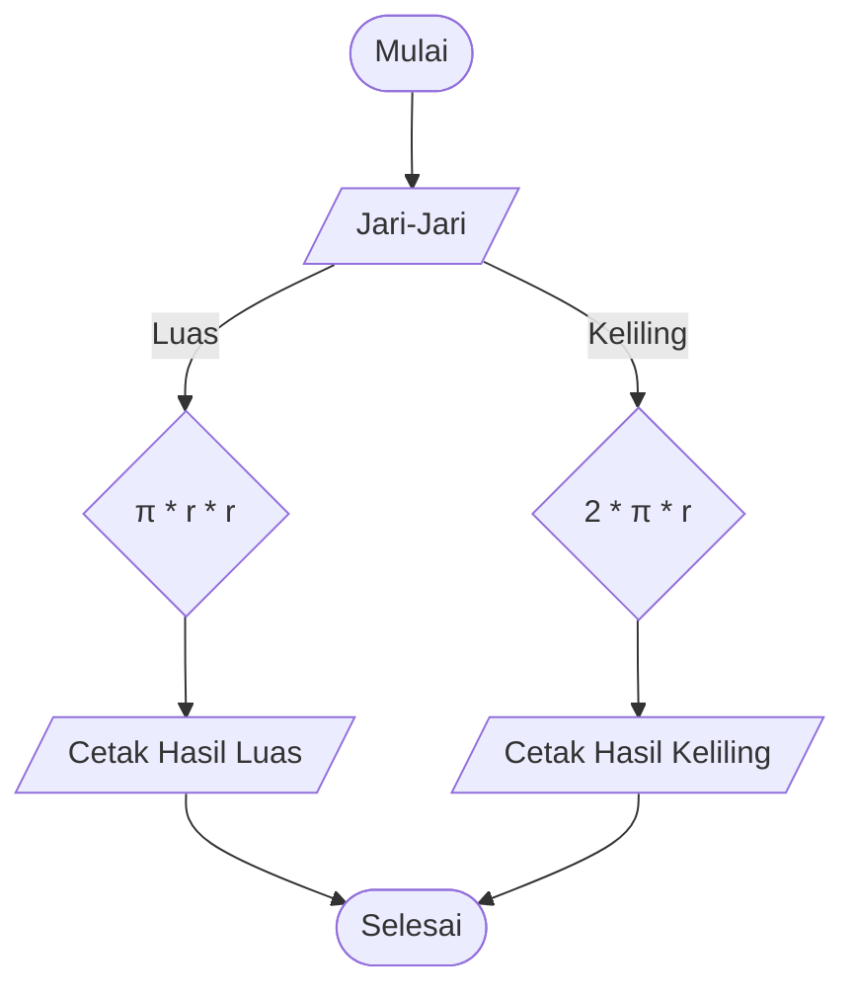

```mermaid
flowchart TD 
    A([Mulai]) --> B[/Jari-Jari/]
    B --> |Luas| Luas{"π * r * r"}

    B --> |Keliling| Keliling{"2 * π * r"}

    Luas --> D[/Cetak Hasil Luas/] --> Z
    Keliling --> E[/Cetak Hasil Keliling/] --> Z
    
    Z([Selesai])
```
