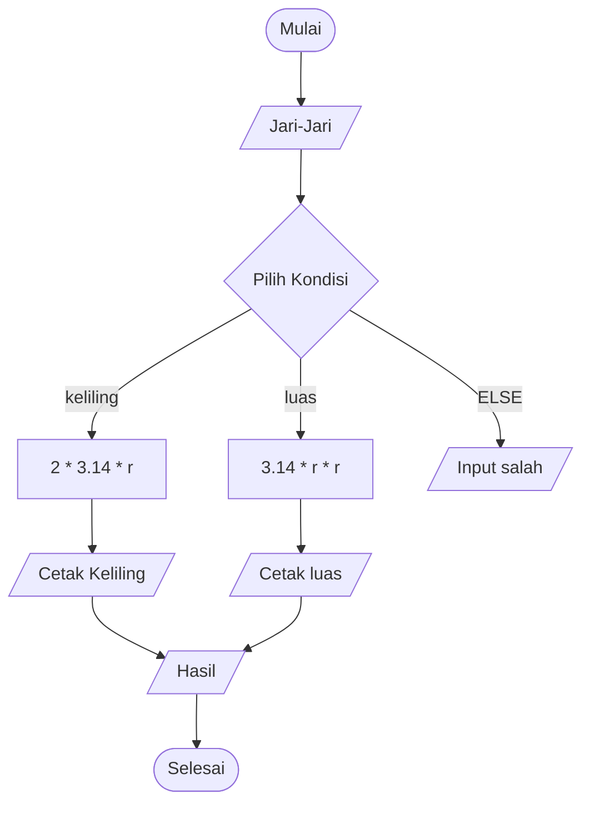

```mermaid
flowchart TD
    A([Mulai]) --> B[/Jari-Jari/]
    B --> C{Pilih Kondisi}
    C --> |luas| D[3.14 * r * r]
    C --> |keliling| E[2 * 3.14 * r]
    C --> |ELSE| F[/Input salah/]
    D --> G[/Cetak luas/]
    E --> H[/Cetak Keliling/]
    H --> X[/Hasil/]
    G --> X
    X --> Z([Selesai])

```
